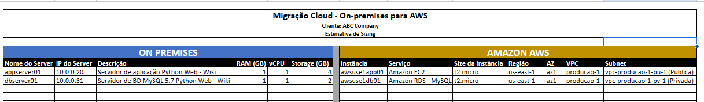

# Migracao-Workload
Migração de um Workload rodando em um Data Center Corporativo para a AWS utilizando o serviço do Amazon EC2 e RDS.

Em mais um projeto baseado em um cenário do mundo real, atuei como Especialista Cloud na migração de workload rodando em um DataCenter Corporativo para a da AWS.
Conforme planejamento, a aplicação e o banco de dados da aplicação foram migrados para a AWS usando o modelo Lift & Shift (rehost), movendo tanto os dados da aplicação como do banco de dados.

Segui algumas etapas de migração, como: Planejamento (sizing, pré-requisitos, nomenclatura dos recursos), Execução (provisionamento dos recursos, melhores práticas), Go-live (teste de validação — Dry-run, migração final — Cutover) e Pós Go-live (garantir o funcionamento da aplicação e acesso dos usuários).

Na arquitetura da solução na AWS, será necessário que implemente a VPC juntamente com suas subnets , a instância EC2 que armazenará a aplicação e a outra instância de RDS que vai armazenar o banco de dados. Para que a sua aplicação seja acessível através da Internet, plugado à sua VPC, você precisará implementar o Internet Gateway. É de extrema importância que siga todas as etapas do processo de migração, para que obtenha sucesso na implementação do seu projeto.

A primeira parte do projeto é o Planejamento (sizing, pré-requisitos, nomenclatura dos recursos). Nesse momento fizemos esse levantamento chegando no que iriamos precisar.

A segunda parte é a execução, onde provisionei os recursos, junto com as melhores práticas.

Comecei com a criação da VPC, e depois uma subnet publica onde vai apontar para nosso servidor EC2, e duas subnets privadas para apontar para nosso servidor RDS, criando uma alta disponibilidade do servidor:

Agora provisionei o servidor EC2 onde irá rodar nossa aplicação, e o servidor RDS, nosso banco de dados.

Após isso precisei criar uma rota para a VPC, para poder acessar nosso servidor onde irá rodar a aplicação, ao acessar instalei todos os pré-requisitos que foram levantados na primeira etapa, para poder rodar a aplicação.

Depois dos pré-requisitos instalados eu subi a aplicação, para fazer o teste se está tudo ok.

e para finalizar testei o funcionamento da aplicação, inserindo um artigo.

Nessa migração deste projeto foi bastante interessante, pois pude aprender muito sobre VPC, e como criar uma estrutura básica, porém bastante funcional e com boas práticas, além de poder aprender mais sobre EC2, e o RDS que é uma ferramenta bastante versátil.
